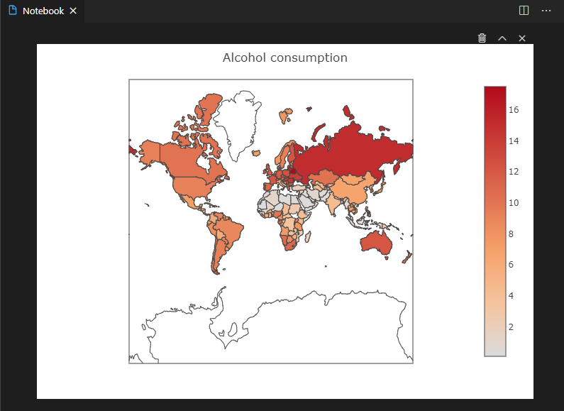

# fsharp-interactive-datascience

> **This extension requires F#5**

[fsharp-interactive-datascience](https://marketplace.visualstudio.com/items?itemName=andriniaina.fsharp-interactive-datascience) is a lightweight visualization tool to assist during data exploration and prototyping. In combination with [ionide](https://ionide.io), VSCode becomes a very capable F# IDE for data science.




## Built-in features

* Register "rich output" printers to FSI
* Render plotly charts, [SVG plots](https://pablofrommars.github.io), HTML fragments, Markdown and text cells
* Export Notebooks to HTML


## Command Palette

* **F# Notebook+DataScience: Open Panel**
* **F# Notebook+DataScience: Export Panel**
* **F# Notebook+DataScience: Clear Panel**

## Settings

* **fsharpnotebook.styles**: A list of CSS style sheets to use in notebooks.
* **fsharpnotebook.exportStyles**: A list of CSS style sheets to use when exporting notebooks.


## Configure [Ionide-fsharp](https://marketplace.visualstudio.com/items?itemName=Ionide.Ionide-fsharp)
Install F# 5: https://dotnet.microsoft.com/download/dotnet/5.0

Locate where fsharp-interactive-datascience extension is installed:
* **Windows** ```%USERPROFILE%\.vscode\extensions\andriniaina.fsharp-interactive-datascience-*```
* **macOS** ```~/.vscode/extensions/andriniaina.fsharp-interactive-datascience-*```
* **Linux** ```~/.vscode/extensions/andriniaina.fsharp-interactive-datascience-*```

Edit VSCode ```settings.json``` in the current workspace:

```json
{
    "FSharp.fsiExtraParameters": [
        "--langversion:preview",
        "--load:path/to/extension/scripts/Notebook.fsx"
    ]
}
```

Open the notebook panel with the command Ctrl+Alt+P > "**F# Notebook+DataScience: Open Panel**"

You can now start coding in an *.fsx file.
> Tip: Alt+Enter will execute the current line

## Usage

### Examples

```fsharp
// Ctrl+Alt+P : F# Notebook: Open Panel
// display markdown
Notebook.Markdown """
# Hello, Markdown!
"""

// display primitive values
Notebook.Text (1+1)

// display dataframes
#r "nuget: Microsoft.Data.Analysis"
open Microsoft.Data.Analysis
let locations, alcohol =
    consumption.Rows
        |> Seq.map (fun row -> row.Location, row.Alcohol)
        |> List.ofSeq
        |> List.unzip
let df = new DataFrame(
    new StringDataFrameColumn("location", locations),
    new PrimitiveDataFrameColumn<decimal>("consumption", alcohol)
)
Notebook.DataFrame df

// display plotly chart
open XPlot.Plotly
open FSharp.Data
let marginWidth = 50.0
let margin = Margin(l = marginWidth, r = marginWidth, t = marginWidth, b = marginWidth)
type AlcoholConsumption = CsvProvider<"https://raw.githubusercontent.com/plotly/datasets/master/2010_alcohol_consumption_by_country.csv">
let consumption = AlcoholConsumption.Load("https://raw.githubusercontent.com/plotly/datasets/master/2010_alcohol_consumption_by_country.csv")
let locations = consumption.Rows |> Seq.map (fun r -> r.Location)
let z = consumption.Rows |> Seq.map (fun r -> r.Alcohol)
let map =
    Chart.Plot([ Choropleth(locations = locations, locationmode = "country names", z = z, autocolorscale = true) ])
    |> Chart.WithLayout(Layout(title = "Alcohol consumption", width = 700.0, margin = margin, geo = Geo(projection = Projection(``type`` = "mercator"))))
Notebook.Plotly map
```

### Custom printers

```fsharp
open Notebook
fsi.AddPrinter(fun (data : YourType) ->
    ... // Format to string
    |> SVG // or HTML or Markdown or Text
    |> printerNotebook
)

let x = new YourType() // this will automatically print x in the notebook panel
```
