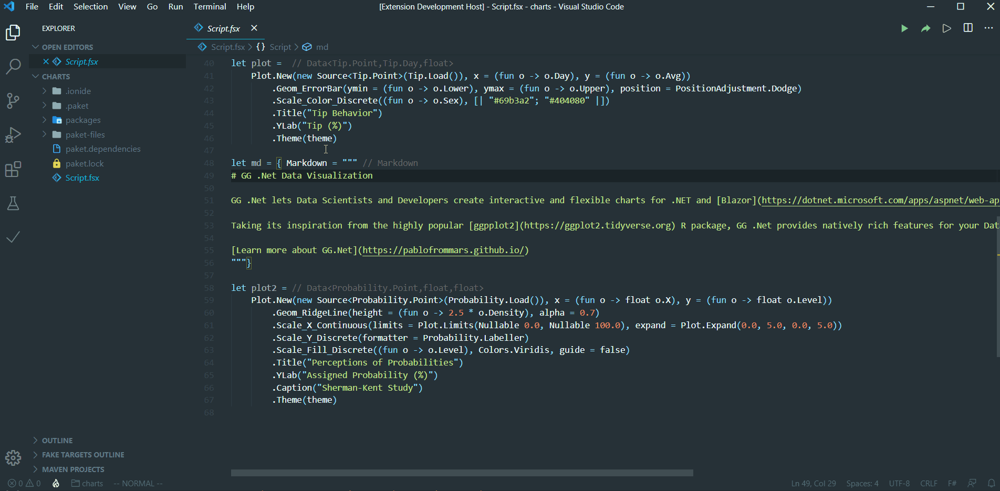

# fsharp-notebook

[fsharp-notebook](https://marketplace.visualstudio.com/items?itemName=PabloBelin.fsharp-notebook) is a lightweight visualization tool to assist during data exploration and prototyping. In combination with [ionide](https://ionide.io), VSCode becomes a very capable F# IDE for data science.



## Features

* Register "rich output" printers to FSI
* Render [SVG plots](https://pablofrommars.github.io), HTML fragments, Markdown and text cells
* Export Notebooks to HTML


## Command Palette

* **F# Notebook: Open Panel**
* **F# Notebook: Export Panel**

## Settings

**fsharpnotebook.styles**: A list of CSS style sheets to use in notebooks.
**fsharpnotebook.exportStyles**: A list of CSS style sheets to use when exporting notebooks.


## Configure [Ionide-fsharp](https://marketplace.visualstudio.com/items?itemName=Ionide.Ionide-fsharp)

Locate where fsharp-notebook extension is installed:
* **Windows** ```%USERPROFILE%\.vscode\extensions\pablobelin.fsharp-notebook-*```
* **macOS** ```~/.vscode/extensions/pablobelin.fsharp-notebook-*```
* **Linux** ```~/.vscode/extensions/pablobelin.fsharp-notebook-*```

And edit VSCode ```settings.json```:

```json
"FSharp.fsiExtraParameters": ["--load:path/to/extension/scripts/Notebook.fsx"]
```

## Usage

### Basic Example

```fsharp
open Notebook

let md = Markdown """
# Hello, Markdown!
"""
```

### Custom printers

```fsharp
fsi.AddPrinter(fun (data : YourType) ->
    ... // Format to string
    |> SVG // or HTML or Markdown or Text
    |> printerNotebook
)
```